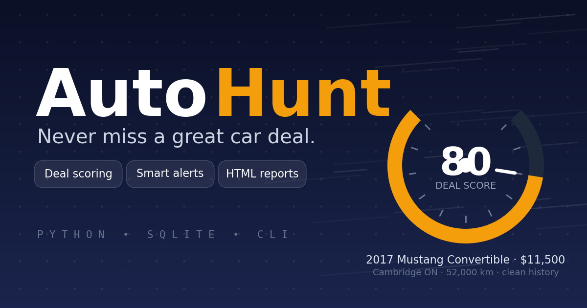
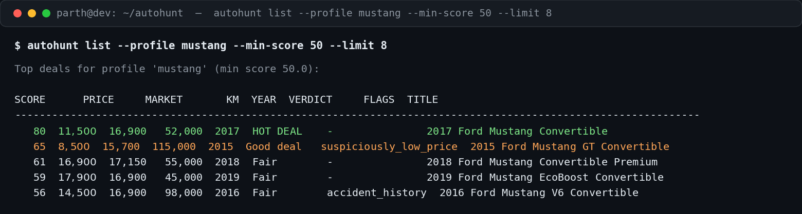

# AutoHunt 🏁

> Car-deal hunter that watches listings, scores deals and alerts you the moment a good one appears.




Good used-car deals die in hours. AutoHunt is a CLI watchdog for car hunters: define what you're looking for in a YAML search profile, let it score every listing 0–100 against live market value, and get alerted the instant a genuine deal — or a price drop on a car you're watching — shows up. It ships with realistic bundled demo data, so the whole thing runs offline, out of the box, with zero dependencies.

## ✨ Features

- **YAML search profiles** — encode exactly what you want: budget, year, mileage, distance, preferred/excluded makes and models. Two real profiles ship by default: a Ford Mustang convertible hunt and a family SUV/sedan hunt.
- **Deal scoring (0–100)** — each listing is scored on price vs. estimated market value, mileage, year and vehicle history, with tunable weights per profile.
- **Market value estimation** — from comparable listings (same make/model/body, ±2 model years) when enough exist, otherwise a depreciation heuristic.
- **Red-flag detection** — accident history, rebuilt/salvage titles, overpriced listings, scam-bait pricing (suspiciously *low* prices), and missing history. Nasty flags cap the score so they can't hide.
- **SQLite store** — listings, full price history, per-profile seen state, watchlist and an alert log. Re-run anytime; only *new* information alerts you.
- **Alert rules** — new high-score deals, price drops on tracked listings, and watch-target hits via `autohunt check`.
- **HTML deal reports** — ranked listings with score bars, red-flag badges and a top-deals chart. Self-contained, no external assets.
- **Graceful source fallback** — AutoTrader/Kijiji-style fetcher slots exist for real connectors; when a live source is unavailable the CLI falls back to bundled demo data with a clear warning. Demo mode is the default and works fully offline.

## 📸 In action

Real output from `autohunt list --profile mustang` on the bundled demo data:



And the generated HTML report (`autohunt report --profile mustang`):

| Rank | Listing | Price | Market | Verdict |
|------|---------|------:|-------:|---------|
| #1 | 2017 Ford Mustang Convertible · Cambridge ON | $11,500 | $16,900 | 🟢 HOT DEAL |
| #2 | 2015 Ford Mustang GT Convertible · St. Catharines | $8,500 | $15,700 | 🟡 Good deal — ⚠️ suspiciously low price |
| #3 | 2018 Ford Mustang Convertible Premium · Burlington | $16,900 | $17,150 | 🟠 Fair |

## 🚀 Quickstart

Requires Python 3.10+. No dependencies to install — everything runs on the standard library (matplotlib is used only for the report chart, when available).

```bash
git clone https://github.com/872000/autohunt.git
cd autohunt

# End-to-end demo on bundled data: fetch → score → alert → HTML report
python3 -m autohunt demo
```

Then hunt for real:

```bash
# See the available search profiles
python3 -m autohunt profiles

# Rank the current deals for a profile
python3 -m autohunt list --profile mustang --min-score 60

# Check alert rules: new deals, price drops, watch targets
python3 -m autohunt check --profile mustang

# Watch a listing and get alerted when it hits your target price
python3 -m autohunt watch demo-mustang-09 --target-price 12000
python3 -m autohunt check --profile mustang   # → 🔔 WATCH TARGET HIT

# Generate the HTML deal report
python3 -m autohunt report --profile mustang
# → .autohunt/reports/report-mustang.html
```

Prefer an installed command? `pip install -e .` gives you the `autohunt` entry point.

Run the test suite:

```bash
python3 -m pytest
```

## 🧠 How scoring works

Every listing matching a profile's hard criteria (year, price, mileage, distance, makes/models/body styles, exclusions) is scored 0–100:

| Component | Weight | What it measures |
|-----------|--------|------------------|
| Price | 45% | Asking price vs. estimated market value (cheaper = better) |
| Mileage | 20% | Lower odometer, scaled to the profile's max mileage |
| Year | 15% | Newer model years score higher |
| History | 20% | Clean one-owner history wins; accidents and title issues hurt |

Verdicts: **HOT DEAL** (80+), **Good deal** (65+), **Fair** (50+), **Skip** (below 50).

Red flags are always surfaced and the worst ones cap the total score — a rebuilt title can never score above 25, and scam-bait pricing (far below market) is capped at 65 and flagged `suspiciously_low_price`.

## 🔎 Search profiles

Profiles live in `profiles/` as plain YAML — no PyYAML required (a built-in parser handles the format when it's not installed):

```yaml
slug: mustang
criteria:
  makes: [Ford]
  models: [Mustang]
  body_styles: [convertible]
  min_year: 2015
  max_price: 20000
  max_mileage_km: 120000
  max_distance_km: 150
preferences:
  excluded_makes: [Buick, Kia, Nissan]
scoring:
  weights: {price: 0.45, mileage: 0.20, year: 0.15, history: 0.20}
alerts:
  min_score: 70
  watch_price_drop_pct: 5.0
```

Copy one, tweak the numbers, and it's yours. Validate anytime with `autohunt profiles`.

## 🗂️ Project structure

```
autohunt/
├── autohunt/            # the package
│   ├── cli.py           # argparse CLI: fetch, list, check, watch, report, demo
│   ├── profiles.py      # YAML profile loading + validation (zero-dep fallback parser)
│   ├── fetchers.py      # demo fetcher (offline default) + AutoTrader/Kijiji slots
│   ├── scoring.py       # matching, market-value estimation, 0–100 scoring, red flags
│   ├── store.py         # SQLite: listings, price history, seen state, watchlist, alerts
│   ├── alerts.py        # alert rules (new deals, price drops, watch targets)
│   ├── report.py        # self-contained HTML deal report + score chart
│   └── config.py        # constants & paths
├── profiles/            # mustang.yaml, family-suv.yaml
├── demo_data/           # 18 realistic bundled listings (works offline)
├── docs/                # hero.png, screenshot-cli.png (+ the scripts that made them)
├── tests/               # 53 tests — `python -m pytest`
├── README.md
├── LICENSE
└── pyproject.toml
```

Runtime state (SQLite db, generated reports) lives in `.autohunt/` next to where you run it, and is gitignored.

## 🗺️ Roadmap

- [ ] Real AutoTrader / Kijiji connectors behind the fetcher interface (bring-your-own session)
- [ ] Email / push notifications for alerts (currently stdout + alert log)
- [ ] Scheduled `check` via cron/launchd with a one-line installer
- [ ] Price-trend charts per listing in the HTML report
- [ ] "Deal quality over time" stats — how fast good deals disappear per profile

## 📄 License

MIT © 2026 Parth (872000). See [LICENSE](LICENSE).
